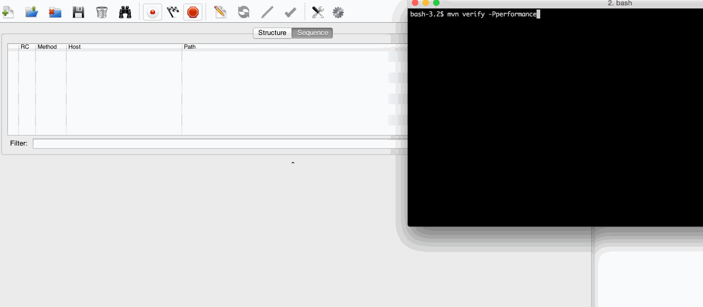

### JMeter Example ####
 
###  Overview ### 

This is an example project for running a `JMeter Load` test for ebay site simulating 10 concurrent users doing different items searches.

It uses **JMeter Maven Plugin** and the **JMeter Analysis Maven Plugin** .

Included is a Testplan `FirstJmeterTest.jmx` that has 1 threadgroup.

Look in the `pom.xml` and `FirstJmeterTest.jmx` as well to dig deeper.

###  Usage ### 

  * Execute `mvn verify -Pperformance`
  * look in `target/jmeter/report/` for the JMeter results file
  * look in `target/reports/` for the Report generated by the JMeter Analysis Maven Plugin

###  Search Data lists ### 

The search data is in the file `testData/searchData.csv`.
  
### Sample Run screenshot as attached ### 

 