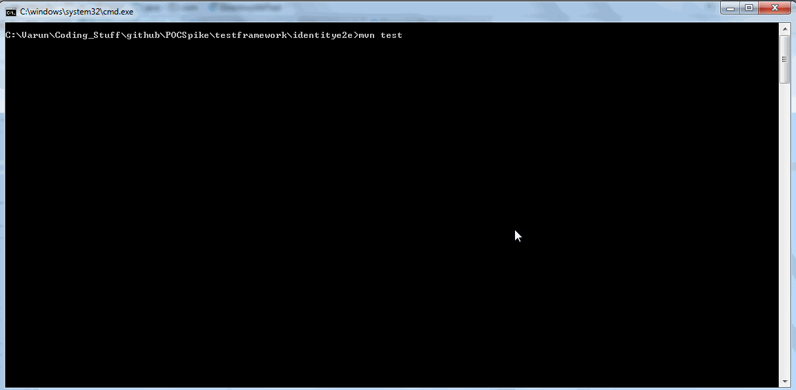

### Run Tests --> mvn test

Part 1:

Write a Service layer bean to do the following:

1. Scan configured directory in file system which will return this information --> filename, file mime type, file size, file extension
    
    `Implementation : DirectoryUtil`
    
    `Unit Test : DirectoryUtilTest`
    
2. Use a directory containing a reasonably large number of files, minimum 10.
   
    `Used current project directory which has more than 10 files`

3. Provide a way to retrieve certain supported mime type files: configure excel and csv are supported currently

    `Please refer to below gif for execution`

Part 2:

Write a selenium/cucumber framework to do the following:

1. Use the above service layer bean to get supported files (excel or csv are supported, from input directory)

2. Go through the file and read vehicle registration details in the file.

3. Open webpage : https://www.gov.uk/get-vehicle-information-from-dvla and go through all vehicles from excel/csv file.

4. On the Vehicle details page assert the details (Make/Color) match with expected output in excel/csv file.